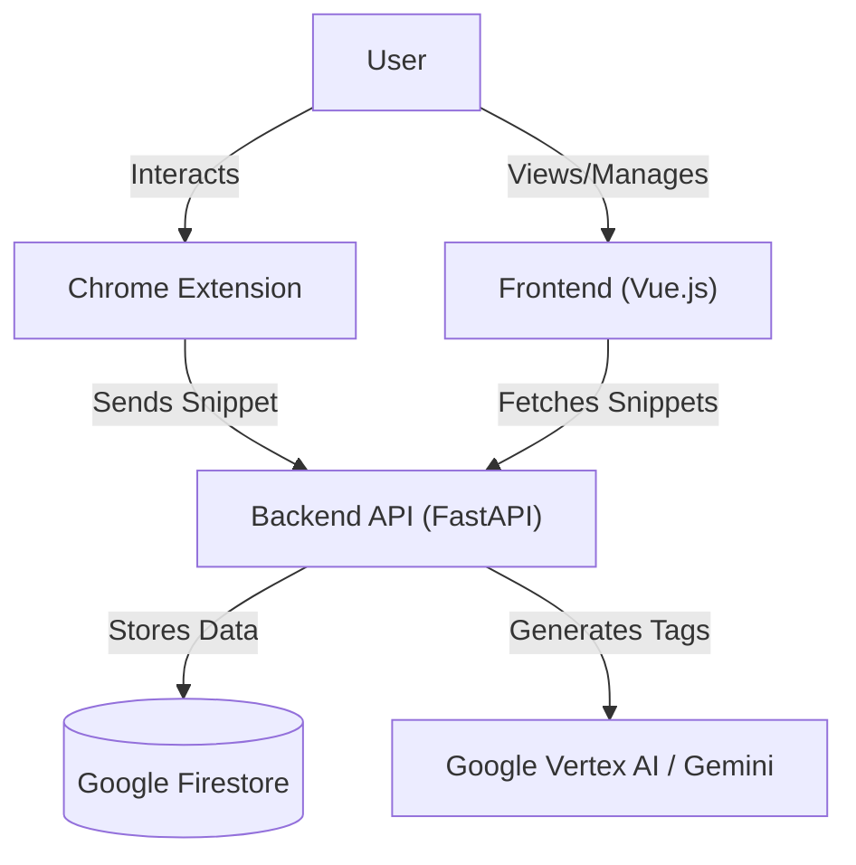

# Ah-Ha! - Capture & Organize AI Insights

**Ah-Ha** is a knowledge management tool designed to transform fleeting AI chat insights into easily retrievable, valuable knowledge assets. It solves the "lost in the noise" problem where critical information generated during AI interactions is buried in long chat logs.

With **Ah-Ha**, you can capture specific snippets from AI conversations (or any web content), automatically categorize them with AI-generated tags, and retrieve them instantly from a centralized library.

## 🚀 Key Features

*   **Capture Anywhere:** specific text snippets from any webpage or AI chat interface using the Chrome Extension.
*   **AI-Powered Organization:** Automatically generates relevant tags for your snippets using Google Gemini / Vertex AI, keeping your library organized without manual effort.
*   **Centralized Library:** A clean, searchable interface to view all your saved "Ah-ha" moments.
*   **Context Preservation:** Keeps a link to the original source so you never lose the context of an insight.
*   **Instant Search:** Find what you need in seconds with keyword filtering across titles, tags, and content.

## 🏗️ Architecture

The project consists of three main components:

1.  **Frontend (`ah-ha-frontend`):** A Vue.js 3 + TypeScript application serving as the main dashboard and library view.
2.  **Backend (`ah-ha-backend`):** A Python FastAPI service that manages data persistence (Google Firestore) and integrates with Google Vertex AI for auto-tagging.
3.  **Chrome Extension (`ah-ha-chrome-extension`):** A Manifest V3 browser extension for capturing content from the web.



## 🛠️ Prerequisites

*   **Node.js** (v18+ recommended) & `npm`
*   **Python** (v3.11+)
*   **Google Cloud Project** with:
    *   Firestore enabled (Native mode)
    *   Vertex AI API enabled
    *   A Service Account with permissions for Firestore and Vertex AI.

## 📦 Installation & Setup

### 1. Clone the Repository

```bash
git clone <repository-url>
cd ah-ha
```

### 2. Backend Setup (`ah-ha-backend`)

1.  Navigate to the backend directory:
    ```bash
    cd ah-ha-backend
    ```

2.  Create and activate a virtual environment:
    ```bash
    python -m venv venv
    source venv/bin/activate  # On Windows: venv\Scripts\activate
    ```

3.  Install dependencies:
    ```bash
    pip install -r requirements.txt
    ```

4.  **Configuration:**
    *   Copy `.env.example` to `.env`:
        ```bash
        cp .env.example .env
        ```
    *   **Crucial:** Place your Google Cloud Service Account JSON key file in the `ah-ha-backend` directory (e.g., named `ah-ha-backend-sa-key.json`).
    *   Update `.env` with your specific configuration:
        *   `GOOGLE_APPLICATION_CREDENTIALS`: Path to your service account key (e.g., `./ah-ha-backend-sa-key.json`).
        *   `GOOGLE_CLOUD_PROJECT`: Your GCP Project ID.
        *   `GOOGLE_CLOUD_LOCATION`: Your GCP Region (e.g., `us-central1`).
        *   `GOOGLE_API_KEY`: Your Gemini API Key (if using API key auth).
        *   `JWT_SECRET_KEY`: Generate a strong random string.

5.  Run the server:
    ```bash
    python main.py
    # OR
    uvicorn main:app --reload --port 8010
    ```
    The backend will start at `http://localhost:8010`.

### 3. Frontend Setup (`ah-ha-frontend`)

1.  Navigate to the frontend directory:
    ```bash
    cd ah-ha-frontend
    ```

2.  Install dependencies:
    ```bash
    npm install
    ```

3.  Start the development server:
    ```bash
    npm run dev
    ```
    The frontend will be available at `http://localhost:5173`.

### 4. Chrome Extension Setup (`ah-ha-chrome-extension`)

1.  Open Google Chrome and navigate to `chrome://extensions/`.
2.  Enable **"Developer mode"** (toggle in the top right).
3.  Click **"Load unpacked"**.
4.  Select the `ah-ha-chrome-extension` directory from this repository.
5.  The extension icon should appear in your browser toolbar.

## 📖 Usage

### Capturing an Insight
1.  Navigate to any website or open the **Mock Chat** in the Frontend (`http://localhost:5173/`).
2.  Select the text you want to capture.
3.  Right-click and select **"Save as Ah-Ha! Snippet"** (if using the context menu feature) OR open the extension popup.
4.  (Optional) Add a title or let the backend generate tags automatically.
5.  The snippet is saved to your library.

### Viewing & Searching
1.  Open the Frontend application (`http://localhost:5173`).
2.  Go to **"My Ah-ha's"**.
3.  You will see your saved snippets sorted by newest first.
4.  Use the search bar to filter by keywords or tags.

## 🤝 Contributing

1.  Fork the repository.
2.  Create a feature branch: `git checkout -b feature/my-new-feature`
3.  Commit your changes: `git commit -m 'Add some feature'`
4.  Push to the branch: `git push origin feature/my-new-feature`
5.  Submit a pull request.

## 📄 License

[MIT License](LICENSE) (Assuming MIT, please verify)
